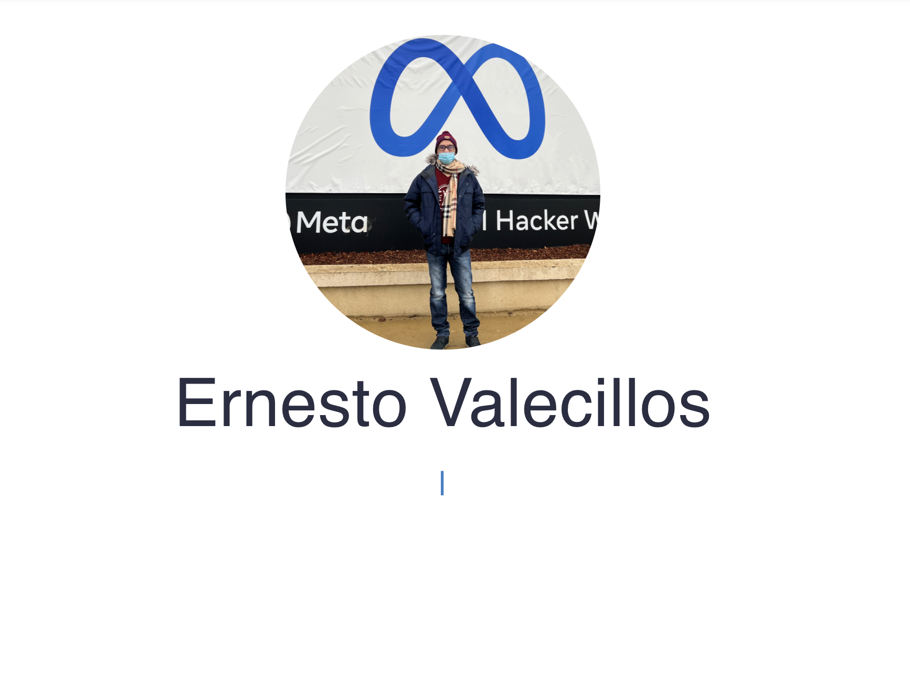

    
    
    
    
    
    

# React portfolio

This is a simple website to showcase my portfolio, built on React with some Material UI

## Preview 👀 

[Click here to go to the live site](https://ernestov.netlify.app/)

## License 📓
[MIT](https://choosealicense.com/licenses/mit/)
